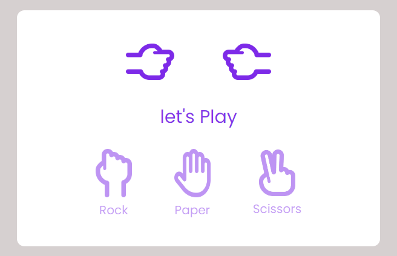

# Rock Paper Scissors Game 😍

---

**`It looks like`**

This is **Home** (you called it),  
Here we see on the **top** Two _players_ following:
- Player
- Computer

We create it like at the begining **Two players** ready to _play_ and both of the player fold there hands _shaking_ and show there turn,
And at the **Middle** we add text area there at the start it's show `let's play` and when you click on any option below as :
- Rock 
- Paper 
- Scissors

then it show or displaying `playing...` 

and after some time it show as the winner or draw as :   
  
**`You Won`**

As we see the player is choose the _**Scissors**_ option and computer choose the _**Paper**_ and according to rule scissors win over paper,
so we see the player is won the match and it shows as **_`You Won`_**  

**`Computer Won`**

**`Match Draw`**
